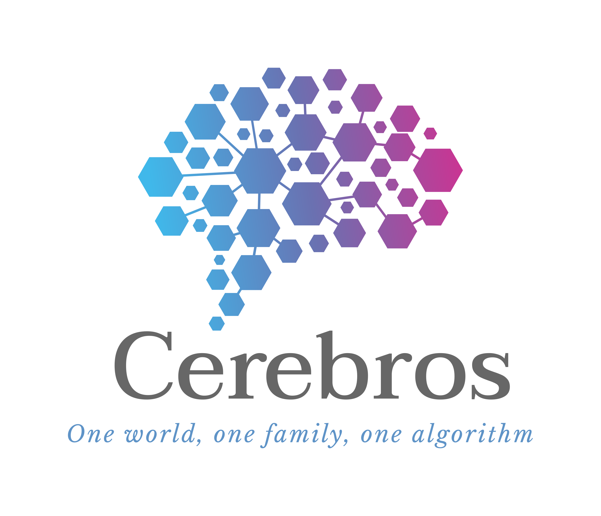
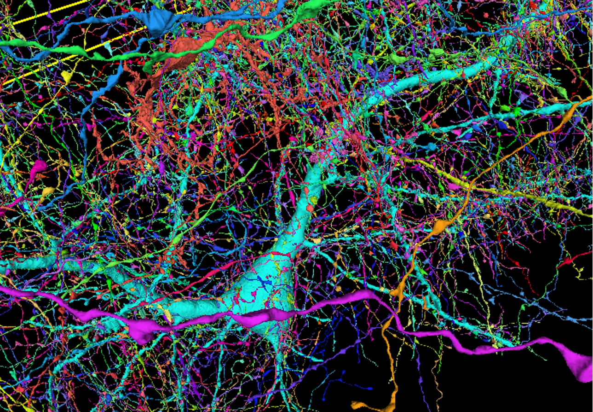
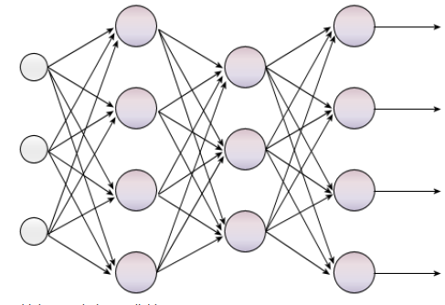
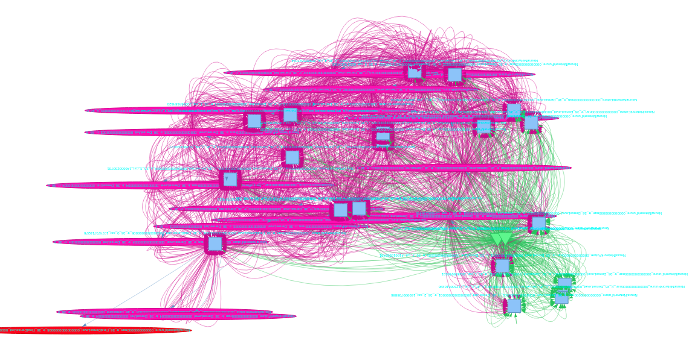
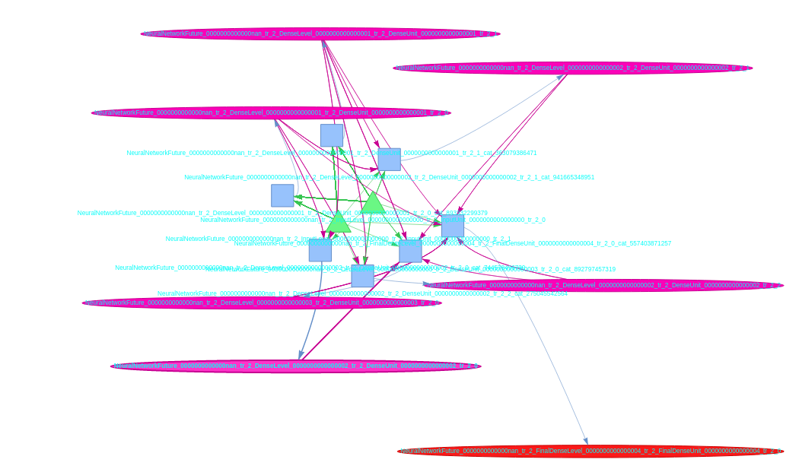
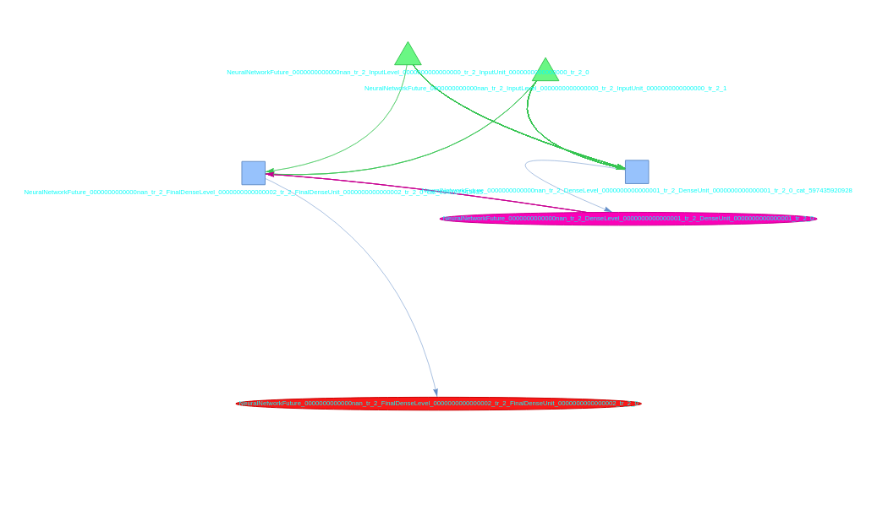

# Cerebros AutoML



The Cerebros package is an ultra-precise Neural Architecture Search (NAS) / AutoML that is intended to much more closely mimic biological neurons than conventional Multi Layer Perceptron based neural network architecture search strategies.

## Cerebros Community Edition and Cerebros Enterprise

The Cerebros community edition provides an open-source minimum viable single parameter set NAS and also also provides an example manifest for an exhaustive Neural Architecture Search to run on Kubeflow/Katib. This is licensed for free use provided that the use is consistent with the ethical use provisions in the license described at the bottom of this page. You can easily reproduce this with the Jupyter notebook in the directory `/kubeflow-pipeline`, using the Kale Jupyter notebook extension. For a robust managed neural architecture search experience hosted on Google Cloud Platform and supported by our SLA, we recommend Cerebros Enterprise, our commercial version. Soon you will be able to sign up and immediately start using it at `https://www.cerebros.one`. In the meantime, we can set up your own Cerbros managed neural architecture search pipeline for you with a one business day turnaround. We offer consulting, demos, full service machine learning service and can provision you with your own full neural architecture search pipeline complete with automated Bayesian hyperparameter search. Contact David Thrower:`david@cerebros.one` or call us at (US country code 1) `(650) 789-4375`. Additionally, we can complete machine learning tasks for your organization. Give us a call.


## In summary what is it and what is different:

A biological brain looks like this:



Multi layer perceptrons look like this:



If the goal of MLPs was to mimic how a biological neuron works, why do we still build neural networks that are structurally similar to the first prototypes from 1989? At the time, it was the closest we could get, but both hardware and software have changed since.

In a biological brain, neurons connect in a multi-dimensional lattice of vertical and lateral connections, which may repeat. Why don't we try to mimic this? In recent years, we got a step closer to this by using single skip connections, but why not simply randomize the connectivity to numerous levels in the network's structure altogether and add lateral connections that overlap like a biological brain? (We presume God knew what He was doing, so why re-invent the wheel.)

That is what we did here. We built a neural architecture search that connects Dense layers in this manner.

What if we made a multi-layer pereceptron that looks like this: (Green triangles are Keras Input layers. Blue Squares are Keras Concatenate layers. The Pink stretched ovals are Keras Dense layers. The one stretched red oval is the network's Output layer. It is presumed that there is a batch normaliation layer between each Concatenate layer and the Dense layer it feeds into.)


... or what if we made one like this:



and like this



What if we made a single-layer perceptron that looks like this:



The deeper technical details can be found here:


## Use example: Try it for yourself:

shell:

Clone the repo
`git clone https://github.com/david-thrower/cerebros-core-algorithm-alpha.git`

cd into it
`cd cerebros-core-algorithm-alpha`

install all required packages
```
pip3 install -r requirements.txt
```
Run the Ames housing data example:
```
python3 regression-example-ames-no-preproc.py
```

## Example output from this task:

```
... # lots of summaries of training trials
...

Best result this trial was: 169.04592895507812
Type of best result: <class 'float'>
Best model name: 2023_01_12_23_42_cerebros_auto_ml_test_meta_0/models/tr_0000000000000006_subtrial_0000000000000000
Best model: (May need to re-initialize weights, and retrain with early stopping callback)
Model: "NeuralNetworkFuture_0000000000000nan_tr_6_nn_materialized"

```

## Summary of Results

- Ames housing data set, not pre-processed or scaled:
- House sell price predictions, val_rmse $169.04592895507812.
- The mean sale price in the data was $180,796.06.
- Val set RMSE was 0.0935% the mean sale price. Yes, you are reading it right. Less than 0.1% off on average.
- There was no pre-trained base model. The data in [ames.csv](ames.csv) is the only data any of the model's weights has ever seen.


Run the Neural Architecture Search and get results back.
```python3
result = cerebros.run_random_search()

print("Best model: (May need to re-initialize weights, and retrain with early stopping callback)")
best_model_found = cerebros.get_best_model()
print(best_model_found.summary())

print("result extracted from cerebros")
print(f"Final result was (val_root_mean_squared_error): {result}")

```

For further details, see 

# Documentation


## Open source license:

[license.md](license.md)

**Licnse terms may be amended at any time as deemed necessry at Cerebros sole discretion.**

## Acknowledgements:

1. My Jennifer and my step-kids who have chosen to stay around and have rode out quite a storm because of my career in science.
2. My son Aidyn, daughter Jenna, and my collaborators Max Morganbesser and Andres Espinosa.
3. Mingxing Tan, Quoc V. Le for EfficientNet (recommeded image embedding base model).
4. My colleagues who I work with every day.
5. Tensorflow, Keras, Kubeflow, Kale, Optuna, Keras Tuner, and Ray open source communities and contributors.
6. Google Cloud Platform, Arikto, Canonical, and Paperspace and their support staff for the commercial compute and ML OPS platforms used.
7. Microk8s, minikube,and the core Kubernetes communities and associated projects.
8. Jacob Devlin, Ming-Wei Chang, Kenton Lee, Kristina Toutanova: "BERT: Pre-training of Deep Bidirectional Transformers for Language Understanding", 2018. Base embedding usee for text classification tests.
9. Andrew Howard1, Mark Sandler1, Grace Chu1, Liang-Chieh Chen1, Bo Chen1, Mingxing Tan2, Weijun Wang1, Yukun Zhu1, Ruoming Pang2, Vijay Vasudevan2, Quoc V. Le2, Hartwig Ada MobileNet image embedding used for CICD tests.

## Legal disclaimers:

1. Cerebros is an independent initiative. Nothing published herein, nor any predictions made by models developed by the Cerebros algorithm should be construed as an opinion of any Cerebros maintainer or contributor or community member nor any of such community member's, clients, or employer, whether private companies, academic institutions, or government agencies.
2. Although Cerebros may produce astoundingly accurate models from a relatively minuscule amount of data as the example above depicts, past performance does not constitute a promise of similar results on your data set or even that such results would bear relevance in your business use case. Numerous variables will determine the outcome of your experiments and models used in production developed therefrom, including but not limited to:
    1. The characteristics, distribution, and scale of your data
    2. Sampling methods used
    3. How data was trained - test split (hint, if samples with identical data is a possibility, random selection is usually not the best way, hashing each sample then modulus division by a constant, and placing samples where the result of this is <= train set proportion, is better. This will force all occurrences of a given set of identical samples on the same side of the train, test split),
    4. Hyperparameter selection and tuning algorithm chosen
    5. Feature selection practices and features available in your use case
    6. Model drift, changes in the patterns in data, trends over time, climate change, social changes over time, evolution, etc.
3. Users are responsible for validating one's own models and the suitability for their use case. Cerebros does not make predictions. Cerebros parses neural networks (models) that your data will train, and these models will make predictions based on your data whether or not it is correct, sampled in a sensible way, or otherwise unbiased and useful. Cerebros does a partial validation, solely by metrics such as 'val_root_mean_squared_error'. This is a preliminary metric of how the model is performing, assuming numerous logical and ethical assumptions that only humans with subject matter expertise can validate (think spurious associations and correlations), in addition to statistical parameters such as valid sampling of the training data and that the distribution of the data is not skewed.
4. The mechanism by which Cerebros works, gives it an ability to deduce and extrapolate intermediate variables which are not in your training data. This is in theory how it is able to make such accurate predictions in data sets which seem to not have enough features to make such accurate predictions. With this said, care should be taken to avoid including proxy variables that can be used to extract variables which are unethical to consider in decision making in your use case. An example would be an insurance company including a variable closely correlated with race and or disability status, such as residential postal code in a model development task which will be used to build models that determine insurance premium pricing. This is unethical, and using Cerebros or any derivitive work to facilitate such is prohibited and will be litigated without notice or opportunity to voluntarily settle, if discovered by Cerebros maintainers.    
5. Furthermore, an association however strong it may be does not imply causality, nor implies that it is ethical to apply the knowledge of such association in your business case. You are encouraged to use as conservative of judgment as possible in such, and if necessary consulting with the right subject matter experts to assist in making these determinations. Failure to do so is a violation of the license agreement.   
