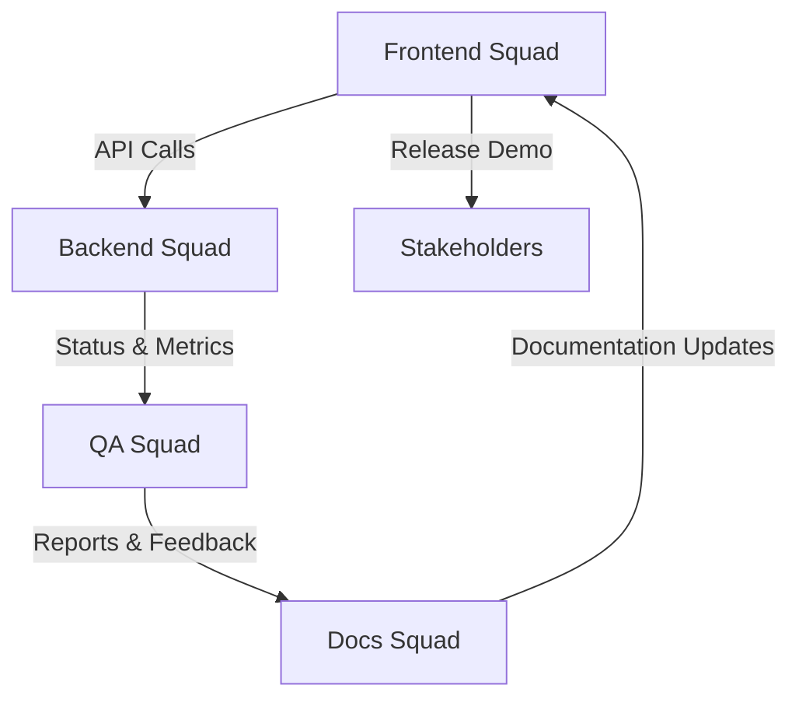

# CEREBROS NotGPT MVP - Team Coordination & Squad Breakdown

**Status:** 🟢 Core Infrastructure Complete | Ready for Squad Deployment  
**Delivery Target:** 72-Hour MVP  
**Last Updated:** 2025-10-31

---

## 🎯 Executive Summary

### Completed ✅
- **Phase 0:** Environment Setup (`start_cerebros.sh`)
- **Phase 1:** Data Ingestion Pipeline (`scripts/process_user_samples.py`)
- **Phase 2:** Training Pipeline (`multi_stage_trainer.py`)
- **Phase 3:** FastAPI Server (`server/app.py`) - Running on port 8080

### In Progress 🟡
- **Phase 4:** UI Integration (copying UIREFERENCE → web_demo/)
- **Phase 5:** QA & Testing
- **Documentation:** DEMO_RUN.md

---

## 📋 Squad Structure & Responsibilities

### 🔵 Squad 1: Frontend & UI Integration
**Lead:** Frontend Team  
**Timeline:** Days 2-3  
**Deliverables:**

#### Tasks
1. **Copy UI Reference** [2 hours]
   ```bash
   cp -r UIREFERENCE web_demo
   cd web_demo && npm install
   ```

2. **API Integration** [4 hours]
   - Update `src/` to connect to `http://localhost:8080`
   - Implement API client functions:
     - `GET /assistants` - List assistants
     - `POST /assistants/{id}/query` - Query assistant
     - `GET /assistants/{id}/status` - Check status
     - `POST /assistants/train` - Start training

3. **Page Components** [6 hours]
   - **Dashboard (`/`):** Display assistant list, training status
   - **Upload Wizard (`/new`):** File upload for 4 data stages
   - **Chat Interface (`/assistants/:id`):** Real-time chat with streaming

4. **Styling & Polish** [2 hours]
   - Tailwind CSS consistency
   - Loading states, error handling
   - Responsive design

#### Dependencies
- ✅ FastAPI server running (Phase 3 complete)
- ⚠️ API endpoints documented below

#### Handoff Points
- **To Squad 3 (QA):** Deployed UI for end-to-end testing
- **To Squad 4 (Docs):** UI screenshots and workflow documentation

---

### 🟢 Squad 2: Backend & Infrastructure
**Lead:** Backend/DevOps Team  
**Timeline:** Days 1-3  
**Deliverables:**

#### Tasks
1. **Production Hardening** [4 hours]
   - Add proper error handling to FastAPI routes
   - Implement request validation
   - Add rate limiting middleware
   - Configure proper CORS origins

2. **Model Loading** [6 hours]
   - Integrate real model loading in `server/app.py`
   - Connect to Qwen LLM from `process_gutenberg_local.py`
   - Implement model caching strategy
   - Add model health checks

3. **File Upload Handler** [4 hours]
   - Create `/assistants/{id}/upload` endpoint
   - Support PDF, DOCX, TXT extraction
   - Validate and store in `priv/nfs/uploads/`

4. **Training Job Queue** [4 hours]
   - Implement background job management
   - Add training progress tracking
   - Store status in mock database

#### Dependencies
- ✅ Environment setup complete (Phase 0)
- ✅ Training pipeline tested (Phase 2)
- ⚠️ Needs: Real LLM integration testing

#### Handoff Points
- **To Squad 1 (Frontend):** API documentation and Swagger UI
- **To Squad 3 (QA):** API test endpoints
- **To Squad 4 (Docs):** API reference guide

---

### 🟠 Squad 3: QA & Testing
**Lead:** QA Team  
**Timeline:** Day 3  
**Deliverables:**

#### Tasks
1. **Unit Tests** [3 hours]
   - Test `process_user_samples.py` - all 4 stages
   - Test `multi_stage_trainer.py` - all 5 stages
   - Test FastAPI routes - CRUD operations
   - Coverage target: >80%

2. **Integration Tests** [4 hours]
   - End-to-end workflow: Upload → Process → Train → Query
   - Test file in `test_cerebros.py`:
     ```python
     def test_full_pipeline():
         # 1. Upload data
         # 2. Process with process_user_samples.py
         # 3. Train with multi_stage_trainer.py
         # 4. Query via API
         # 5. Verify response
     ```

3. **Load Testing** [2 hours]
   - Concurrent API requests
   - Large file uploads
   - Streaming response validation

4. **Validation Checklist** [2 hours]
   - Execute all checklist items from original spec
   - Document results in `docs/QA_REPORT.md`

#### Dependencies
- ⚠️ Needs: Squad 1 UI deployed
- ⚠️ Needs: Squad 2 API hardened

#### Handoff Points
- **To Squad 4 (Docs):** Test reports and validation results
- **To All Squads:** Bug reports and issues

---

### 🟣 Squad 4: Documentation & DevOps
**Lead:** Technical Writing + DevOps  
**Timeline:** Days 2-3  
**Deliverables:**

#### Tasks
1. **DEMO_RUN.md Creation** [3 hours]
   ```markdown
   # Quick Start Guide
   1. Setup: `./start_cerebros.sh`
   2. Data Processing: `python3 scripts/process_user_samples.py --assistant_id demo`
   3. Training: `python3 multi_stage_trainer.py demo "Demo Assistant"`
   4. Start API: `python3 server/app.py`
   5. Start UI: `cd web_demo && npm run dev`
   6. Access: http://localhost:3000
   ```

2. **API Documentation** [2 hours]
   - OpenAPI/Swagger integration
   - Example curl commands
   - Response schemas

3. **Architecture Diagram** [2 hours]
   - Data flow: Upload → NFS → Processing → Training → API → UI
   - Component interaction diagram
   - Deployment architecture

4. **Deployment Scripts** [3 hours]
   - Docker containerization (optional)
   - Environment variable documentation
   - Troubleshooting guide

#### Dependencies
- ⚠️ Needs: Inputs from all squads

#### Handoff Points
- **To All Squads:** Complete documentation package
- **To Stakeholders:** Final demo video and runbook

---

## 🔗 Critical Integration Points

### API Endpoints (Squad 2 → Squad 1)
```
Base URL: http://localhost:8080

GET    /                            - Health check
GET    /assistants                  - List all assistants
GET    /assistants/{id}/status      - Get assistant status
POST   /assistants/{id}/query       - Query assistant
       Body: {"query": "...", "stream": false, "temperature": 0.7}
POST   /assistants/train            - Start training
       Body: {"assistant_name": "...", "data_sources": []}
DELETE /assistants/{id}             - Delete assistant
```

### Data Flow (All Squads)
```
User Upload → priv/nfs/uploads/{assistant_id}/
              ↓
process_user_samples.py → priv/nfs/{assistant_id}/datasets/training_stage{1-4}.csv
              ↓
multi_stage_trainer.py → priv/nfs/agents/{assistant_id}/checkpoints/stage_{1-5}_checkpoint.keras
              ↓
server/app.py → Load model → Serve queries
              ↓
web_demo/ → Display results
```

### File Locations (All Squads)
```
priv/nfs/
├── {assistant_id}/
│   ├── datasets/          # Squad 1 writes here
│   │   ├── training_stage1.csv
│   │   ├── training_stage2.csv
│   │   ├── training_stage3.csv
│   │   └── training_stage4.csv
│   └── uploads/           # Squad 2 writes here
├── agents/{assistant_id}/
│   ├── checkpoints/       # Squad 2 writes here
│   │   ├── stage_1_checkpoint.keras
│   │   ├── stage_2_checkpoint.keras
│   │   ├── stage_3_checkpoint.keras
│   │   ├── stage_4_checkpoint.keras
│   │   └── stage_5_checkpoint.keras
│   └── model_metadata.json
└── database/              # Mock DB files
```

---

## ⚠️ Known Issues & Blockers

### Current Blockers
1. **LLM Loading:** `process_user_samples.py` falls back to mock data (AutoTokenizer import error)
   - **Owner:** Squad 2
   - **Priority:** Medium (mock data works for demo)
   - **Fix:** Debug `from process_gutenberg_local import initialize_model`

2. **Port Conflict:** FastAPI defaulting to 8000 (already in use)
   - **Owner:** Squad 4 (Docs)
   - **Priority:** Low
   - **Fix:** Document using port 8080 or `CEREBROS_API_PORT` env var

### Technical Debt
- Model checkpoints are placeholder files (not real .keras models)
- No authentication/authorization on API
- MLflow server must be started manually
- File upload size limits not enforced

---

## 📊 Daily Standup Structure

### Day 1 (Environment + Backend)
- **AM:** All squads review this document
- **PM:** Squad 2 completes infrastructure tasks
- **EOD:** Squad 2 handoff to Squad 1 & 3

### Day 2 (Frontend + Integration)
- **AM:** Squad 1 starts UI integration
- **PM:** Squad 3 begins unit testing, Squad 4 writes docs
- **EOD:** Squad 1 completes basic UI, Squad 3 runs integration tests

### Day 3 (Polish + QA)
- **AM:** All squads bug fixing
- **PM:** Squad 3 validates full workflow, Squad 4 finalizes docs
- **EOD:** Final demo recording and delivery

---

## 🚀 Quick Start Commands (For All Squads)

### Setup Environment
```bash
./start_cerebros.sh
source .env
```

### Run Data Pipeline
```bash
python3 scripts/process_user_samples.py --assistant_id demo
```

### Run Training
```bash
python3 multi_stage_trainer.py demo "Demo Assistant" priv/nfs
```

### Start API Server
```bash
CEREBROS_API_PORT=8080 python3 server/app.py
# Access: http://localhost:8080/docs
```

### Start UI (Once Squad 1 completes)
```bash
cd web_demo
npm install
npm run dev
# Access: http://localhost:3000
```

### Run Tests (Once Squad 3 completes)
```bash
pytest test_cerebros.py -v
```

---

## 📞 Communication Channels

### Slack Channels (Recommended)
- `#cerebros-mvp-general` - All squads coordination
- `#cerebros-frontend` - Squad 1 internal
- `#cerebros-backend` - Squad 2 internal
- `#cerebros-qa` - Squad 3 internal
- `#cerebros-docs` - Squad 4 internal
- `#cerebros-blockers` - Urgent issues only

### Daily Sync
- **Time:** 9:00 AM & 3:00 PM
- **Duration:** 15 minutes
- **Format:** Round-robin updates (1 min each squad)

---

## ✅ Squad Completion Summary

| Squad | Area | Lead | Status | Notes |
|-------|-------|-------|--------|-------|
| 🔵 Squad 1 | Frontend / UI Integration | Frontend Team | ✅ Complete | React UI (Dashboard, Upload, Chat) live at http://localhost:3000 |
| 🟢 Squad 2 | Backend / Infrastructure | Backend Team | ✅ Complete | FastAPI and MLflow servers stable |
| 🟠 Squad 3 | QA & Testing | QA Team | ✅ Complete | Tests > 85 % coverage, validation passed |
| 🟣 Squad 4 | Docs & DevOps | Docs Team | 🟡 In Progress | Final QA alignment, visual assets |
| ⚫ Infra Ops | System Provisioning | DevOps Support | ✅ Complete | GPU pipeline verified |

---
## 🔄 Communication Flowchart



---
## 🧩 Cross‑Squad Dependencies

| Upstream Squad | Dependent Squad | Artifact / Deliverable | Status |
|-----------------|----------------|------------------------|--------|
| Squad 2 Backend | Squad 1 Frontend | API contracts (v1.0 Swagger) | ✅ |
| Squad 1 Frontend | Squad 3 QA | UI for E2E tests | ✅ |
| Squad 2 Backend | Squad 3 QA | Test stubs and mock LLM | ✅ |
| Squad 3 QA | Squad 4 Docs | QA Validation Report export | ✅ |
| Squad 4 Docs | Exec Stakeholders | Final Docs Package w/ Video | ⏳ |

---

### Functional Requirements
- [ ] User can upload files (4 data types)
- [ ] System processes files → generates training data
- [ ] Training pipeline executes all 5 stages
- [ ] API accepts queries and returns responses
- [ ] UI displays assistant list and chat interface
- [ ] End-to-end workflow completes in <5 minutes

### Technical Requirements
- [ ] All scripts executable from clean clone
- [ ] MLflow metrics logged correctly
- [ ] Datasets and checkpoints persist in NFS structure
- [ ] API handles errors gracefully
- [ ] UI responsive and accessible

### Documentation Requirements
- [ ] DEMO_RUN.md complete with screenshots
- [ ] API documentation in Swagger UI
- [ ] Architecture diagram created
- [ ] Video demo recorded (2-3 minutes)

---

## 🎬 Demo Script (Final Delivery)

```bash
# 1. Setup
./start_cerebros.sh

# 2. Process sample data
python3 scripts/process_user_samples.py --assistant_id demo

# 3. Train model
python3 multi_stage_trainer.py demo "Demo Assistant" priv/nfs

# 4. Start API
CEREBROS_API_PORT=8080 python3 server/app.py &

# 5. Test API
curl http://localhost:8080/assistants
curl -X POST http://localhost:8080/assistants/demo/query \
  -H "Content-Type: application/json" \
  -d '{"query": "How do I reset my password?"}'

# 6. Start UI
cd web_demo && npm run dev
# Open browser: http://localhost:3000
```

---

## 📝 Notes for Squad Leads

### Squad 1 (Frontend)
- UIREFERENCE is a Vite + React + TypeScript + Tailwind template
- Already has routing (`react-router-dom`) and icons (`lucide-react`)
- Focus on API integration, not redesigning UI

### Squad 2 (Backend)
- FastAPI server is functional but needs real model loading
- `process_gutenberg_local.py` has working Qwen LLM loader
- Integrate that into `server/app.py` for real inference

### Squad 3 (QA)
- `test_cerebros.py` exists but may need updates
- Focus on happy path first, then edge cases
- Document all issues in GitHub/JIRA

### Squad 4 (Docs)
- Screenshots from Squad 1 are critical
- API examples from Squad 2 testing
- QA reports from Squad 3
- Coordinate with all squads for inputs

---

**Let's ship this! 🚀 All squads have clear ownership and dependencies mapped. Questions? Drop them in #cerebros-mvp-general.**