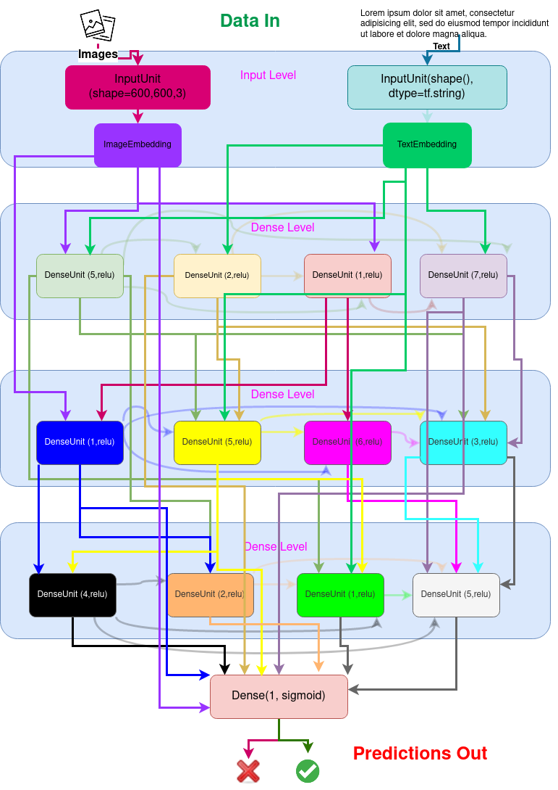

# How Cerebros Works

## Summary

If the goal of MLPs was to mimic how a biological neuron works, why do we still build neural networks that are structurally similar to the first prototypes from 1989? At the time, it was the closest we could get, but both hardware and software have changed since.

In a biological brain, neurons connect in a multi-dimensional lattice of vertical and lateral connections, which may repeat. Why don't we try to mimic this? In recent years, we got a step closer to this by using single skip connections, but why not simply randomize the connectivity between Dense layers vertically to other Dense layers resting on numerous levels in the network's structure and add lateral connections that overlap and may repeat like a biological brain? (We presume God knew what He was doing, so why re-invent the wheel.)

That is in summary, what we did here. We built a neural architecture search that connects Dense layers in this manner.

See below:

The goal here is to recursively generate models consisting of "Levels" which consist of of Dense Layers in parallel, where the Dense layers on one level randomly connect to layers on not only its subsequent Level, but multiple levels below. In addition to these randomized vertical connections, the Dense layers also connect **latrally** at random to not only their neighboing layer, but to layers multiple layers to the right of them (remember, this architectural pattern consists of "Levels" of Dense layers. The Dense layers make lateral connections to the other Dense layers in the same level, and vertial connections to Dense layers in their level's successor levels). There may also be more than one connection between a given Dense layer and another, both laterally and vertically, which if you have the patience to follow the example neural architectre created by the Ames housing data example below, (I dare you to try following the connectivity in that), you will probably see many instances where this occurs. This may allow more complex networks to gain deeper, more granular insight on smaller data sets before problems like internal covariate shift, vanishing gradients, and exploding gradients drive overfitting, zeroed out weights, and "predictions of [0 | infiniti] for all samples". Bear in mind that the deepest layers of a Multi - Layer Perceptron will have the most granular and specific information about a given data set.  In recent years, we got a step closer that this does by using single skip connections, but why not simply randomize the connectivity to numerous levels in the network's structure altogether and add lateral connections that overlap like a biological brain? (We presume God knew what He was doing.)
